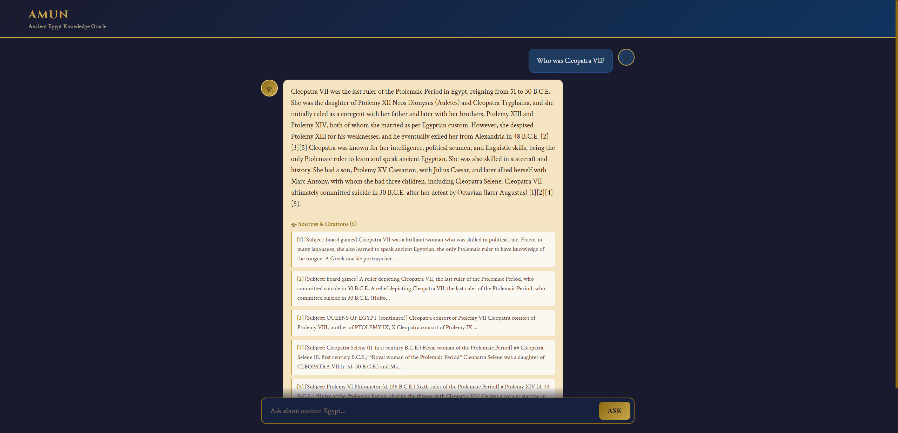

# Ancient Egypt RAG QA Assistant

A production-grade Retrieval-Augmented Generation system for answering questions about Ancient Egyptian civilization. Built with an agentic LangGraph workflow that retrieves, validates, and generates source-grounded answers from the **Encyclopedia of Ancient Egypt**.



## Features

- **Agentic RAG Pipeline** -- a LangGraph state machine that orchestrates guardrails, retrieval, grading, and generation as discrete nodes with conditional routing
- **Domain Guardrail** -- LLM scores every query 0-100 for relevance to Ancient Egypt; queries below the threshold are rejected before any retrieval happens
- **Query Decomposition** -- detects multi-hop questions and splits them into independent sub-queries for parallel retrieval
- **Hybrid Search** -- combines BM25 keyword retrieval (40%) with Chroma vector similarity (60%) via EnsembleRetriever
- **Cross-Encoder Re-Ranking** -- retrieved documents are re-ranked with `BAAI/bge-reranker-v2-m3` to surface the most relevant passages
- **LLM Document Grading** -- an LLM evaluates whether retrieved documents are relevant; irrelevant results trigger automatic query rewriting and re-retrieval
- **Generation Quality Checks** -- every generated answer is checked for hallucination (grounded in sources?) and relevance (answers the question?), with automatic retry on failure
- **Adaptive Re-Retrieval** -- failed grading triggers query rewriting and re-retrieval, up to 2 attempts, before falling back gracefully
- **Inline Citations** -- answers reference numbered sources (`[1]`, `[2]`, ...) so every claim is traceable to the encyclopedia
- **SSE Streaming** -- real-time word-by-word response delivery via Server-Sent Events
- **State Persistence** -- SQLite-backed checkpointing stores the full agent state for every request, inspectable via API
- **LangSmith Tracing** -- every node in the pipeline is traced for observability and debugging
- **Request ID Tracing** -- each HTTP request gets a unique correlation ID in logs and response headers
- **Token Tracking** -- input/output token counts and latency are recorded per request with running averages

## Architecture

```
                              ┌─────────┐
                              │  START  │
                              └────┬────┘
                                   │
                                   ▼
                         ┌───────────────────┐
                         │    Guardrail       │
                         │  LLM scores 0-100  │
                         └────────┬──────────┘
                            ┌─────┴─────┐
                            │           │
                       score ≥ 60    score < 60
                            │           │
                            ▼           ▼
                  ┌──────────────┐  ┌──────────────┐
                  │  Decompose   │  │ Out of Scope │
                  │  Query       │  │  Response     │
                  └──────┬───────┘  └──────┬───────┘
                         │                 │
                         ▼                 ▼
                  ┌──────────────┐      ┌─────┐
                  │   Retrieve   │      │ END │
                  │  Emit tool   │      └─────┘
                  │   calls      │
                  └──────┬───────┘
                    ┌────┴──────┐
                    │           │
              tool_calls    max retries
                    │        reached
                    ▼           │
            ┌─────────────┐    ▼
            │  ToolNode    │ ┌─────┐
            │ Hybrid search│ │ END │
            │  + rerank    │ └─────┘
            └──────┬──────┘
                   │
                   ▼
          ┌─────────────────┐
          │    Process       │
          │   Retrieval      │
          │  JSON → Docs     │
          └────────┬────────┘
                   │
                   ▼
          ┌─────────────────┐
          │ Grade Documents  │
          │ LLM relevance   │
          └────────┬────────┘
             ┌─────┴──────┐
             │            │
          relevant    not relevant
             │            │
             ▼            ▼
     ┌──────────────┐  ┌───────────────┐
     │   Generate   │  │ Rewrite Query │◄──────────┐
     │   Answer     │  │  Optimize for │           │
     │  w/ citations│  │   retrieval   │           │
     └──────┬───────┘  └───────┬───────┘           │
            │                  │                   │
            ▼                  └───► Retrieve ─────┘
     ┌──────────────────┐            (retry loop)
     │ Grade Generation  │
     │ Hallucination +   │
     │ relevance checks  │
     └────────┬─────────┘
         ┌────┴────┐
         │         │
       accept    retry
         │         │
         ▼         └──► Rewrite Query
      ┌─────┐
      │ END │
      └─────┘
```

## Project Structure

```
app/
├── api/
│   ├── main.py              # FastAPI app, CORS, lifespan, static files
│   ├── middleware.py         # Request ID middleware + log filter
│   ├── dependencies.py      # Dependency injection for pipeline functions
│   ├── schemas.py            # Request/response Pydantic models
│   └── routes/
│       └── chat.py           # /chat, /chat/stream, /state/{id}, /health, /metrics
│
├── core/
│   ├── config.py             # Centralized settings (Pydantic BaseSettings + .env)
│   ├── state.py              # AgentState TypedDict for the LangGraph workflow
│   ├── models.py             # Pydantic schemas for structured LLM outputs
│   ├── prompts.py            # All prompt templates
│   ├── graph.py              # LangGraph StateGraph builder + SqliteSaver checkpointer
│   └── pipeline.py           # Component init, token tracking, API-facing functions
│
├── nodes/
│   ├── guardrail.py          # Domain relevance scoring (threshold 60)
│   ├── out_of_scope.py       # Rejection response for off-topic queries
│   ├── decompose.py          # Simple vs multi-hop query classification
│   ├── retrieve.py           # Emits tool_calls for ToolNode execution
│   ├── process_retrieval.py  # Parses ToolMessage JSON back into Documents
│   ├── grade_documents.py    # LLM relevance grading with routing decision
│   ├── rewrite_query.py      # Query optimization for re-retrieval
│   ├── generate.py           # Cited answer generation from graded documents
│   ├── grade_generation.py   # Hallucination + answer relevance checks
│   └── utils.py              # Message extraction helpers
│
├── retrieval/
│   ├── hybrid.py             # BM25 + Chroma EnsembleRetriever builder
│   └── tools.py              # Retriever tool (hybrid search + CrossEncoder reranking)
│
└── ingestion/
    ├── parser.py             # PDF -> Markdown via LlamaParse
    └── chunker.py            # Markdown header + character splitting

frontend/
├── templates/
│   └── index.html            # Chat UI (Amun - Ancient Egypt Knowledge)
└── static/
    ├── css/style.css
    └── js/chat.js            # SSE streaming client

evaluation/
├── create_dataset.py         # Upload eval QA pairs to LangSmith
└── run_experiment.py         # LLM-as-judge correctness experiments

scripts/
└── build_index.py            # End-to-end: parse PDF -> chunk -> embed -> persist to Chroma

data/
├── ancient_egypt.pdf         # Source PDF (Encyclopedia of Ancient Egypt)
├── ancient_egypt.md          # Parsed markdown
├── eval_dataset.json         # Evaluation QA pairs
├── vectorstore/              # Chroma persistent database
└── checkpoints.sqlite        # LangGraph state persistence
```

## Quick Start

### Prerequisites

- **Python 3.12+**
- **Ollama** running locally with an embedding model
- An **OpenAI-compatible LLM endpoint** (OpenRouter, GitHub Models, Azure, etc.)
- **LlamaParse API key** (only needed if rebuilding the vector store from PDF)
- **LangSmith API key** (optional, for tracing and evaluation)

### Installation

**Clone the repository**

```bash
git clone https://github.com/your-username/Historical-RAG-QA-Assistant.git
cd Historical-RAG-QA-Assistant
```

**Create virtual environment**

```bash
python -m venv .venv
source .venv/bin/activate        # Linux/macOS
.venv\Scripts\activate           # Windows
```

**Install Python dependencies**

```bash
pip install -r requirements.txt
```

Or with optional dev/eval tools:

```bash
pip install -e ".[dev,eval]"
```

**Configure environment**

```bash
cp .env.example .env
```

Edit `.env` with your keys:

```env
# LLM (any OpenAI-compatible endpoint)
API_KEY=your-api-key
ENDPOINT=YOUR-CLOUD-PROVIDER
MODEL_ID=openai/gpt-4o

# PDF Parsing (only for rebuilding the vector store)
LLAMAPARSE_API_KEY=your-llamaparse-key

# Embeddings (Ollama)
OLLAMA_ENDPOINT=http://localhost:11434
OLLAMA_EMBEDDING_MODEL=qwen3-embedding:8b

# Re-Ranking
RERANKER_MODEL_NAME=BAAI/bge-reranker-v2-m3

# LangSmith (optional)
LANGSMITH_TRACING=true
LANGSMITH_ENDPOINT=https://api.smith.langchain.com
LANGSMITH_API_KEY=your-langsmith-key
LANGSMITH_PROJECT=your-project-name
```

**Pull the embedding model**

```bash
ollama pull qwen3-embedding:8b
```

**Build the vector store** (Optional)

```bash
python -m scripts.build_index
```

**Run the server**

```bash
uvicorn app.api.main:app --reload --port 8000
```

The API is available at `http://localhost:8000` with interactive docs at `/docs`. The chat UI is served at the root `/`.

### API Endpoints

| Method | Endpoint              | Description                                    |
|--------|-----------------------|------------------------------------------------|
| GET    | `/api/health`         | Deep health check (Chroma + Ollama)            |
| POST   | `/api/chat`           | JSON response with answer, sources, thread ID  |
| POST   | `/api/chat/stream`    | SSE stream with chunked answer and sources     |
| GET    | `/api/state/{id}`     | Inspect full agent state for a thread          |
| GET    | `/api/metrics`        | Running averages for latency and token usage   |

## Tech Stack

| Layer         | Technology                                                    |
|---------------|---------------------------------------------------------------|
| Framework     | FastAPI, Uvicorn                                              |
| Orchestration | LangGraph (StateGraph, ToolNode, conditional edges)           |
| LLM           | Any OpenAI-compatible API via LangChain (`ChatOpenAI`)        |
| Embeddings    | Ollama (`qwen3-embedding:8b`)                                |
| Vector Store  | Chroma                                                        |
| Keyword Search| BM25 via `rank-bm25`                                         |
| Re-Ranking    | CrossEncoder (`BAAI/bge-reranker-v2-m3`) via sentence-transformers |
| Checkpointing | SQLite via `langgraph-checkpoint-sqlite`                      |
| Observability | LangSmith tracing, request ID correlation, token metrics      |
| PDF Parsing   | LlamaParse (agentic tier)                                     |
| Evaluation    | OpenEvals (LLM-as-judge) + LangSmith datasets                |
| Frontend      | Vanilla HTML/CSS/JS with SSE streaming                        |

## License

This project is licensed under the MIT License. See the [LICENSE](LICENSE) file for details.
